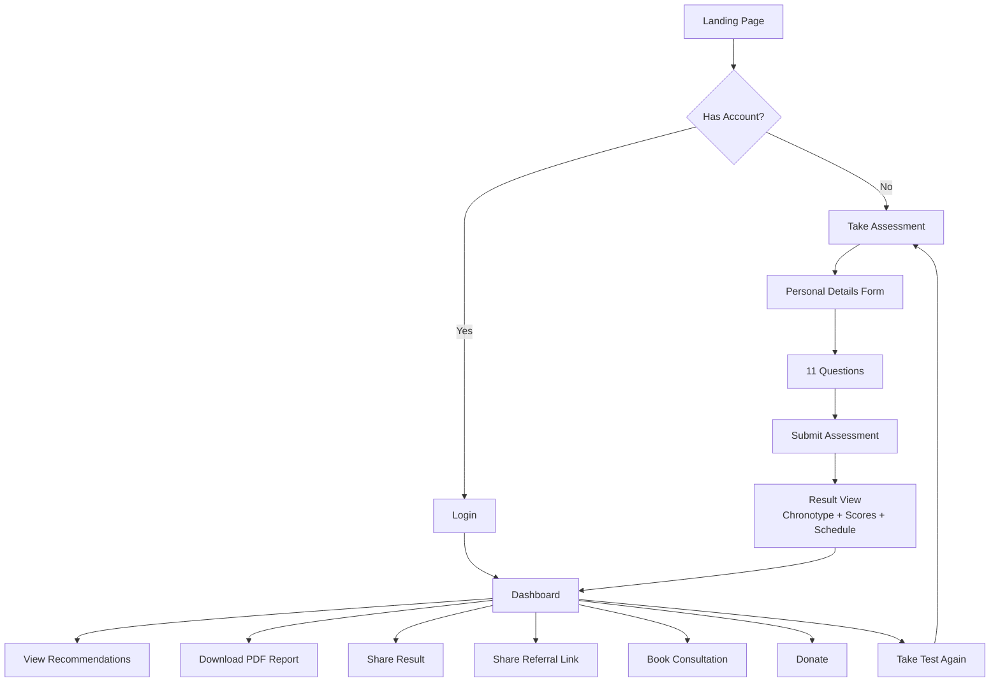
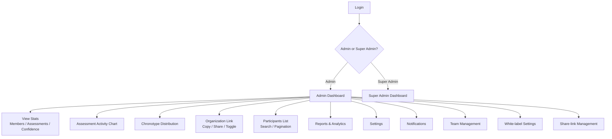
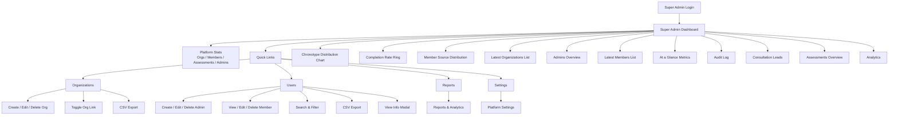
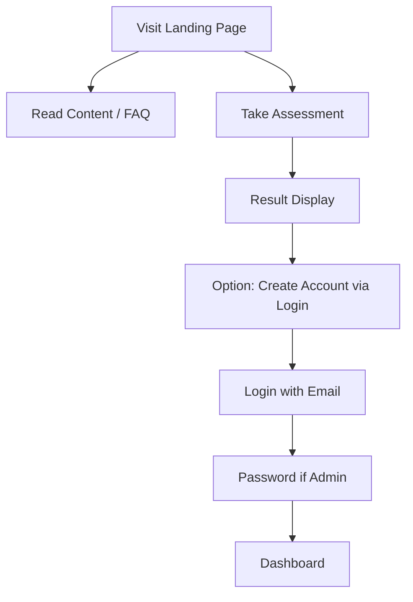
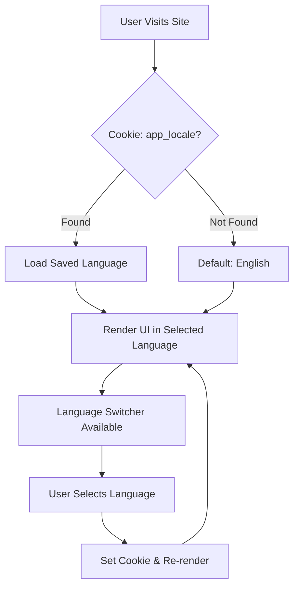

# 03 — User Flows

**SDASD Sleep Chronotype & Wellness Platform**  
**Version:** 1.0  
**Date:** 2026-08-14

---

## Flow Overview

This document describes the actual user flows implemented in the current codebase. Only steps that exist in the code are documented.

---

## 1. Member Flow



### Step-by-Step

| Step | Route/Action | Description |
|------|-------------|-------------|
| 1 | `/` | Visitor lands on public landing page with 14 educational sections |
| 2 | Click "Take Test Now" | Assessment modal opens |
| 3 | Personal Details Form | Enter name, age, gender, marital status, location, occupation, email, phone, org code, referral code; agree to terms |
| 4 | Start Assessment | Member record created; assessment ID generated; questionnaire begins |
| 5 | Answer 11 Questions | Multiple-choice questions with progress bar; auto-save on each answer |
| 6 | Submit Assessment | Answers sent to server; chronotype calculated |
| 7 | Result View | Chronotype (Lark/Eagle/Owl), scores (lark/eagle/owl/total/confidence), ideal schedule (wake time, bedtime, peak focus), recommendations |
| 8 | Dashboard | Redirected to `/dashboard` with full result |
| 9 | View Recommendations | Chronotype-specific tips displayed on dashboard |
| 10 | Download PDF | Client-side PDF generated and downloaded |
| 11 | Share Result | Generates public link `/[origin]/r/[assessmentId]` |
| 12 | Share Referral | Member's unique referral link shared via clipboard or native share |
| 13 | Book Consultation | Pre-filled consultation modal; lead submitted |
| 14 | Donate | Donation modal opens |
| 15 | Retake Assessment | "Take Test Again" button opens fresh assessment |

### Alternate Paths

- **URL with `?ref=[code]`:** Referral code auto-detected and locked in form
- **URL with `/[orgCode]`:** Organization code auto-detected and locked in form
- **Existing in-progress assessment:** Resume prompt with "Resume" or "Start Over" options
- **Logged-in member returning:** Dashboard loads latest result automatically

---

## 2. Organization Admin Flow



### Step-by-Step

| Step | Route/Action | Description |
|------|-------------|-------------|
| 1 | `/login` | Admin enters email |
| 2 | Email check | System detects admin role → prompts for password |
| 3 | Password sign-in | Clerk authenticates; redirected to `/admin/dashboard` |
| 4 | Admin Dashboard | Stats loaded: total members, assessments, avg confidence, org link status |
| 5 | View Charts | Assessment activity (line chart) and chronotype distribution (ring charts) |
| 6 | Organization Link | View unique code, copy/share URL, toggle active/paused |
| 7 | Participants | Search members, view paginated list with source type and join date |
| 8 | Sub-pages | Navigate to Reports, Analytics, Settings, Notifications, Team, White-label, Share-link |

### Alternate Paths

- **Org settings via API:** Admin can update org name, type, email, country, branding via `/api/admin?action=org-settings` and `update_org_settings`
- **CSV export:** Participants can be exported from sub-pages where implemented

---

## 3. Super Admin Flow



### Step-by-Step

| Step | Route/Action | Description |
|------|-------------|-------------|
| 1 | `/superadmin/login` | Super Admin enters email |
| 2 | Email check | System detects superadmin role → prompts for password |
| 3 | Password sign-in | Clerk authenticates; redirected to `/superadmin/dashboard` |
| 4 | Super Admin Dashboard | Platform overview: orgs, members, assessments, admins |
| 5 | View Charts | Chronotype distribution (bar chart), completion rate (ring), member source distribution |
| 6 | Quick Links | Navigate to Organizations, Users, Reports, Settings |
| 7 | Organizations | CRUD + search + pagination + CSV export |
| 8 | Users | Manage admins and members with separate sections, search, filters, CSV export |
| 9 | Sub-pages | Audit, Consultations, Assessments, Analytics, Reports, Settings |

### Alternate Paths

- **Create Organization:** Fill form → unique code auto-generated → org link active by default
- **Create Admin:** Select organization → enter details → password set via Clerk
- **Member info:** View last assessment answers via `/api/member-detail?member_id=...`
- **CSV export:** Multiple modes (full details, contacts only, emails only)
- **Toggle org link:** Activate/pause organization sharing link

---

## 4. Public Visitor Flow (No Account)



### Step-by-Step

| Step | Route/Action | Description |
|------|-------------|-------------|
| 1 | `/` | Anonymous visitor views landing page |
| 2 | Scroll sections | Reads about chronotypes, sleep science, benefits |
| 3 | Click CTA | Opens assessment modal |
| 4 | Complete assessment | Views result inline |
| 5 | Optional: Login | Goes to `/login` to save result and access dashboard |

---

## 5. Shared Result View Flow (Public Link)

```mermaid
flowchart TD
    A[Member Shares Result Link] --> B[Recipient Clicks Link]
    B --> C[/r/[assessmentId] Page Loads]
    C --> D{Fetch Result via API}
    D -->|Found| E[Render Result Card]
    D -->|Not Found| F[404 / Not Found]
    E --> G[View Chronotype, Scores, Recommendations, Gallery]
```

### Step-by-Step

| Step | Route/Action | Description |
|------|-------------|-------------|
| 1 | `/r/[assessmentId]` | Public URL accessed |
| 2 | ISR cache check | Cached for 5 minutes |
| 3 | Fetch result | `/api/public-result/[assessmentId]` |
| 4 | Render card | SharedResultCard with full result details |

---

## 6. Error & Edge Case Flows

| Scenario | Flow |
|----------|------|
| **No account found** | Login → email not in DB → "No account found" → prompt to take assessment |
| **In-progress assessment** | Reopen assessment modal → resume prompt → Resume or Start Over |
| **Network error on submit** | Error message displayed → user can retry |
| **Database error** | Dashboard shows error + SQL setup instructions if relation missing |
| **Access denied** | Role check fails → "Access denied" message |
| **PDF generation error** | Download button re-enables; non-blocking |
| **Assessment abandoned mid-way** | Answers saved incrementally; can resume later |

---

## 7. Internationalization Flow



### Step-by-Step

| Step | Route/Action | Description |
|------|-------------|-------------|
| 1 | Any page | Server reads `app_locale` cookie |
| 2 | Locale resolution | Valid locale from cookie or default `en` |
| 3 | Render | HTML `lang` and `dir` attributes set |
| 4 | Language switcher | User clicks switcher → cookie updated → page re-renders |
| 5 | Assessment translation | Questions translated client-side via `translateAssessment` |

**Supported languages:** English, Hindi, Marathi, Bengali, Tamil, Telugu, Gujarati, Kannada, Punjabi, Oriya

---

*All flows are based on the current codebase implementation. Proposed or future flows are not included.*
