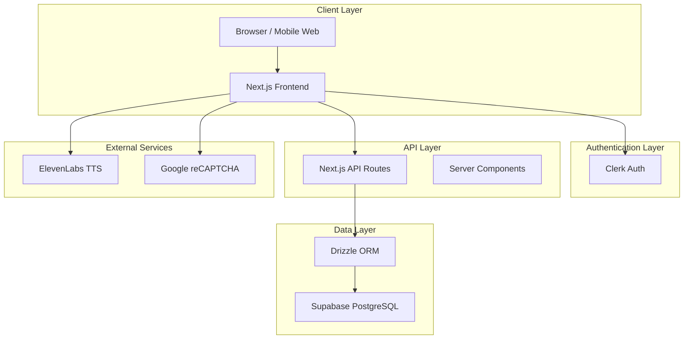
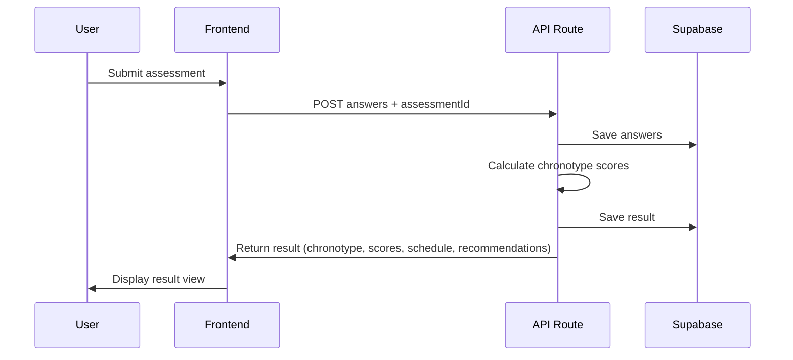
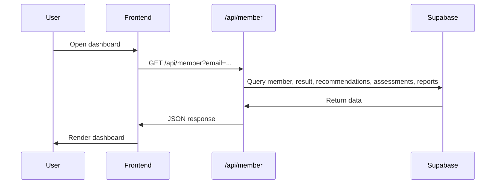
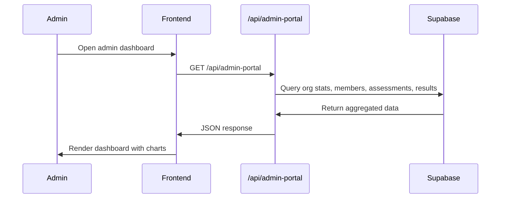

# 09 — Technical Architecture Overview

**SDASD Sleep Chronotype & Wellness Platform**  
**Version:** 1.0  
**Date:** 2026-08-14

> **Note:** This document is PM-friendly and focuses on high-level architecture, technologies, and system interactions. It does not include secrets, low-level implementation details, or internal code architecture.

---

## 1. High-Level Architecture



---

## 2. Frontend

### Technology
- **Framework:** Next.js 16.2.6 (App Router)
- **Language:** TypeScript 5.9
- **Styling:** Tailwind CSS v4.1 + CSS modules
- **Fonts:** Poppins (via `next/font/google`, weights 400, 500, 600, 700)
- **State Management:** React Context (Auth, Assessment, Consult)
- **Animations:** Framer Motion 12.42
- **Smooth Scroll:** Lenis 1.3
- **Internationalization:** next-intl 4.13
- **Icons:** Lucide React 1.25

### Architecture Pattern
- **App Router** with server and client components
- **Server Components** for data fetching where possible
- **Client Components** for interactive features (modals, forms, charts)
- **Context Providers** for auth, assessment state, consultation, TTS, i18n

### Key Pages
- `/` — Public landing page (14 sections)
- `/login` — Member/Admin login
- `/superadmin/login` — Super Admin login
- `/dashboard/*` — Member dashboard and sub-pages
- `/admin/dashboard/*` — Organization Admin dashboard and sub-pages
- `/superadmin/dashboard/*` — Super Admin dashboard and sub-pages
- `/r/[assessmentId]` — Public result sharing page
- `/api/*` — Backend API routes

### Client-Side Features
- Assessment modal with multi-step form
- PDF generation (`@react-pdf/renderer`)
- Charts (custom SVG-based: Bars, Ring, MiniLine, EnergyChart, ScoreBars)
- Text-to-speech (ElevenLabs)
- Infinite scroll / pagination
- CSV export
- Smooth scrolling navigation
- Language switching

---

## 3. Backend / API

### Technology
- **Runtime:** Next.js API Routes (Edge/Node.js)
- **ORM:** Drizzle ORM 0.45
- **Database:** PostgreSQL (via Supabase)

### API Route Structure

| Route | Purpose | Auth |
|-------|---------|------|
| `/api/member` | Fetch member data, results, recommendations, assessments, reports | Public (email/member_id param) |
| `/api/admin` | Platform stats, orgs, admins, members CRUD | Clerk auth |
| `/api/admin-portal` | Admin dashboard stats | Clerk auth |
| `/api/admin-org` | Organization details, members, admins | Clerk auth |
| `/api/admin-assessments` | Assessment data for admin | Clerk auth |
| `/api/admin-audit` | Audit log | Clerk auth |
| `/api/admin-settings` | Admin settings | Clerk auth |
| `/api/admin-reports` | Admin reports | Clerk auth |
| `/api/reports/generate` | Server-side PDF generation | — |
| `/api/public-result/[id]` | Public result page data | Public |
| `/api/tts` | Text-to-speech proxy | — |
| `/api/auth/check-user` | Check if email exists and determine role | Public |
| `/api/auth/redirect` | Auth redirect handling | Clerk |
| `/api/consultation-leads` | Submit consultation lead | Public |
| `/api/org-link-status` | Check org link status | Public |
| `/api/org-branding` | Fetch org branding | Public |
| `/api/member-detail` | Member detail with last assessment answers | Clerk auth |
| `/api/health` | Health check endpoint | Public |
| `/api/webhooks/clerk` | Clerk webhook handler | Clerk secret |

### Server-Side Logic
- Assessment submission and scoring
- Member creation and management
- Organization CRUD
- Admin user management
- Report generation (client-side fallback)
- CSV export data preparation

---

## 4. Authentication

### Provider
- **Clerk** (`@clerk/nextjs` v7.5)
- Email + password authentication
- Role-based access via Clerk `publicMetadata.role`

### Role Mapping
```typescript
Clerk role → Internal role
member → member
admin → organization_admin
organization_admin → organization_admin
superadmin → superadmin
super_admin → superadmin
```

### Session Management
- Clerk handles primary authentication
- Client-side session stored in React Context (`AuthProvider`)
- Session nonce for page show/hide persistence
- Logout clears both Clerk session and client context

### Route Protection
- **Client-side:** Role checks in dashboard components
- **Server-side:** `auth()` from Clerk in API routes and server components
- **Public routes:** Landing page, login, public result page

---

## 5. Database

### Provider
- **Supabase** (PostgreSQL)
- **ORM:** Drizzle ORM

### Key Tables

| Table | Purpose |
|-------|---------|
| `members` | Member profiles (demographics, contact, org link, referral code) |
| `assessments` | Assessment records (status, started/completed timestamps) |
| `assessment_answers` | Individual question answers |
| `chronotype_results` | Assessment results (chronotype, scores, confidence) |
| `member_recommendations` | Recommendations linked to members |
| `reports` | Generated report records |
| `organizations` | Organization profiles |
| `organization_links` | Shareable organization links |
| `organization_admins` | Admin users linked to organizations |

### Schema Management
- SQL schema files in `supabase/` directory
- `schema.sql`, `schema2.sql`, `schema3.sql`
- Drizzle config in `drizzle.config.json`

---

## 6. Storage

### Current Implementation
- **Database:** Supabase PostgreSQL (primary data store)
- **File Storage:** Supabase Storage (for org branding logos, referenced in `branding_logo` field)
- **Static Assets:** `public/` directory in Next.js

### Asset Types
- Images: hero backgrounds, section images, chronotype gallery images
- Icons: Inline SVGs, Lucide icons
- Fonts: Poppins via Google Fonts CDN

---

## 7. PDF Generation

### Technology
- **Library:** `@react-pdf/renderer` v4.5
- **Method:** Client-side generation in browser
- **Trigger:** "Download Report" button → dynamic import of PDF generator

### Process
1. User clicks "Download Report"
2. Client imports `ChronotypeReportPDF` component
3. Builds report view model from member data
4. Renders multi-page A4 PDF document
5. Triggers browser download

### Report Structure
- Page 1: Header, metadata, chronotype hero, schedule, strengths/watch-outs, next steps
- Gallery pages: Chronotype imagery (one image per page)
- Recommendations page: Up to 6 recommendations in 2 columns
- Disclaimer on every page

### Server-Side Alternative
- `/api/reports/generate` exists but returns 501 (Not Implemented)
- Client-side is the only working method currently

---

## 8. Hosting & Deployment

### Current Stack
- **Framework:** Next.js 16.2.6
- **Deployment:** Vercel (inferred from Next.js configuration)
- **Database:** Supabase cloud
- **Auth:** Clerk cloud
- **TTS:** ElevenLabs cloud API

### Environment
- `.env.local` for local development (not committed)
- Supabase URL and anon key required
- Clerk keys required
- ElevenLabs API key required

---

## 9. External Services

| Service | Purpose | Integration |
|---------|---------|-------------|
| **Clerk** | Authentication, user management | `@clerk/nextjs` SDK |
| **Supabase** | Database, auth backup, storage | `@supabase/supabase-js`, `@supabase/ssr` |
| **ElevenLabs** | Text-to-speech | `@elevenlabs/elevenlabs-js` |
| **Google reCAPTCHA** | Bot protection | `react-google-recaptcha` |
| **Vercel** (inferred) | Hosting and CDN | Next.js deployment |

---

## 10. Key Architectural Decisions

| Decision | Rationale |
|----------|-----------|
| **Next.js App Router** | Modern React patterns, server components, improved performance |
| **Clerk over Supabase Auth** | Simpler role management, better UX for email+password |
| **Supabase over raw PostgreSQL** | Managed service, real-time capabilities, built-in auth backup |
| **Drizzle ORM** | Type-safe, lightweight, good TypeScript support |
| **Client-side PDF** | Avoids server resource constraints; works with static hosting |
| **Context API over Redux** | Simpler state management for moderate complexity |
| **Framer Motion** | Smooth animations with good React integration |
| **Tailwind CSS v4** | Modern utility-first CSS with improved performance |
| **Poppins font** | Matches brand identity; loaded via next/font for performance |

---

## 11. Known Technical Limitations

1. **Client-side PDF only:** Server-side PDF API returns 501. For high-volume usage, consider server-side generation.
2. **Client-side auth checks:** Some admin routes rely on client-side role checks. Server-side enforcement should be audited.
3. **No event tracking:** No analytics platform integrated (no PostHog, Mixpanel, etc.).
4. **No CDN for dynamic assets:** Chronotype gallery images and other dynamic assets served from origin.
5. **ISR for public results:** Shared result pages use ISR with 5-minute revalidation. Real-time updates may be delayed.
6. **No background job queue:** Long-running tasks (email sending, report generation) run synchronously.

---

## 12. Data Flow Diagrams

### Assessment Submission Flow



### Member Dashboard Data Flow



### Admin Dashboard Data Flow



---

*This architecture overview is based on the current codebase. It is intended for Product Manager and stakeholder understanding, not as a detailed engineering specification.*
