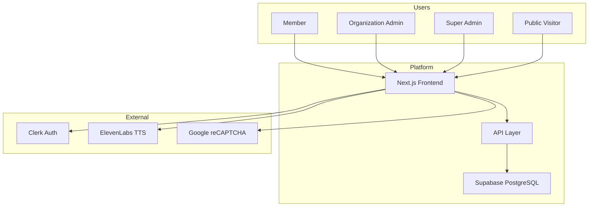

# Software Requirements Specification (SRS)

**SDASD Sleep Chronotype & Sleep Wellness Platform**  
**Version:** 1.0  
**Date:** 2026-08-14  
**Status:** Draft — Based on current codebase inspection  
**Prepared for:** Product Manager, Client Stakeholders, Development Team  

---

## Table of Contents

1. [Introduction](#1-introduction)
2. [System Overview](#2-system-overview)
3. [Functional Requirements](#3-functional-requirements)
4. [Non-Functional Requirements](#4-non-functional-requirements)
5. [System Architecture](#5-system-architecture)
6. [Data Requirements](#6-data-requirements)
7. [Interface Requirements](#7-interface-requirements)
8. [Security & Compliance](#8-security--compliance)
9. [Constraints & Assumptions](#9-constraints--assumptions)
10. [Appendices](#10-appendices)

---

## 1. Introduction

### 1.1 Purpose

This Software Requirements Specification (SRS) defines the functional and non-functional requirements for the **SDASD Sleep Chronotype & Sleep Wellness Platform**. It is based on inspection of the current codebase and reflects only implemented or clearly planned features.

### 1.2 Scope

The platform enables:
- **Individuals** to discover their sleep chronotype through an assessment and receive personalized wellness guidance
- **Organizations** (corporate, healthcare, education, NGO) to run branded sleep wellness programs for their members
- **Platform administrators** to manage organizations, users, and platform-wide settings

### 1.3 Definitions

| Term | Definition |
|------|------------|
| **Chronotype** | A person's natural tendency to sleep at a particular time during a 24-hour period |
| **Lark** | Morning-type chronotype — peaks early, winds down early |
| **Eagle** | Intermediate chronotype — adaptable, peaks midday |
| **Owl** | Evening-type chronotype — peaks late, prefers later schedules |
| **Assessment** | The questionnaire that determines a user's chronotype |
| **Report** | A PDF document summarizing the user's chronotype result and recommendations |
| **Organization** | A company, institution, or group that uses the platform for sleep wellness programs |
| **Organization Link** | A shareable URL (e.g., `/[uniqueCode]`) that pre-fills the organization code for new members |
| **Referral Code** | A unique code assigned to members for sharing the platform |
| **Consultation** | A booking request to speak with a sleep specialist |

### 1.4 References

| Document | Location |
|----------|----------|
| Product Requirements Document | `docs/product-manager/01-PRD.md` |
| Feature Requirements | `docs/product-manager/02-Feature-Requirements.md` |
| User Flows | `docs/product-manager/03-User-Flows.md` |
| Roles & Permissions | `docs/product-manager/04-User-Roles-Permissions.md` |
| UI/UX Specification | `docs/product-manager/05-UI-UX-Specification.md` |
| Assessment & Result Logic | `docs/product-manager/06-Assessment-Result-Logic.md` |
| Product Roadmap | `docs/product-manager/07-Product-Roadmap.md` |
| Analytics Requirements | `docs/product-manager/08-Analytics-Requirements.md` |
| Technical Architecture | `docs/product-manager/09-Technical-Architecture-Overview.md` |
| UAT Testing Plan | `docs/product-manager/10-UAT-Testing.md` |

---

## 2. System Overview

### 2.1 System Purpose

The SDASD Sleep Chronotype & Wellness Platform is a web-based health-tech application that:
- Educates users about sleep chronotypes through a public landing page
- Collects sleep habit data via an 11-question assessment
- Classifies users as Lark, Eagle, or Owl chronotypes
- Provides personalized recommendations and a downloadable PDF report
- Supports organization-branded wellness programs with admin dashboards
- Enables platform-wide management via Super Admin controls

### 2.2 System Context



### 2.3 User Classes

| User Class | Description | Access |
|------------|-------------|--------|
| **Public Visitor** | Anonymous user visiting the landing page | Landing page, assessment modal |
| **Member** | Individual who completed the assessment | Dashboard, reports, consultation, donation |
| **Organization Admin** | Manages an organization's wellness program | Admin dashboard, participants, org settings |
| **Super Admin** | Platform-level administrator | Super Admin dashboard, org CRUD, user management, audit |

### 2.4 Operating Environment

- **Client:** Modern web browsers (Chrome, Firefox, Safari, Edge) on desktop and mobile
- **Server:** Next.js 16.2.6 (Node.js runtime)
- **Database:** PostgreSQL via Supabase cloud
- **Authentication:** Clerk cloud service
- **TTS:** ElevenLabs cloud API

---

## 3. Functional Requirements

### 3.1 Public Landing Page

**FR-001:** The system shall display a public landing page with 14 editorial sections covering sleep science, chronotype introduction, optimization tips, pillars of daily energy, better sleep benefits, why sleep matters, sleep cycles, common sleep disorders, warning signs, sleep facts, additional guidance, FAQ, and disclaimer.

**FR-002:** The system shall provide a "Take Test Now" call-to-action that opens the assessment modal.

**FR-003:** The system shall support smooth scroll navigation between sections.

**FR-004:** The system shall display a fixed navigation bar with brand, section links, and CTA button.

**FR-005:** The system shall adapt layout for mobile, tablet, and desktop viewports.

---

### 3.2 Assessment Flow

**FR-006:** The system shall present a personal details form (Step 0) collecting: first name, last name, age, gender, marital status, department, country, city, pincode, occupation, email, phone, state/location, organization code, referral code, and terms agreement.

**FR-007:** The system shall validate all required fields and display appropriate error messages.

**FR-008:** The system shall present 11 multiple-choice questions (Steps 1–11) covering sleep habits, energy patterns, and lifestyle.

**FR-009:** The system shall display a progress bar and step dots indicating assessment advancement.

**FR-010:** The system shall auto-save each answer to the server as the user progresses.

**FR-011:** The system shall support resuming an in-progress assessment if the user closes and reopens the modal.

**FR-012:** The system shall detect organization code from URL path (e.g., `/AB0001`) and lock the field.

**FR-013:** The system shall detect referral code from URL query parameter (e.g., `?ref=ABC123`) and lock the field.

**FR-014:** The system shall support 10 languages: English, Hindi, Marathi, Bengali, Tamil, Telugu, Gujarati, Kannada, Punjabi, Oriya.

---

### 3.3 Assessment Submission & Scoring

**FR-015:** The system shall submit all answers to the server upon completion.

**FR-016:** The server shall calculate chronotype scores and classify the user as Lark, Eagle, or Owl.

**FR-017:** The system shall return: `chronotype`, `lark_score`, `eagle_score`, `owl_score`, `total_score`, `confidence_score`, `schedule` (wake time, bedtime, peak focus), `recommendations`, `memberName`, `referralCode`, `generatedAt`.

**FR-018:** The system shall generate a personalized 24-hour energy curve based on chronotype and scores.

**FR-019:** The system shall derive schedule times from specific question answers:
- Q1 (wake time) → wakeTime
- Q2 (bedtime) → bedtime
- Q3 (peak productivity) → peakFocus
- Q10 (natural sleepiness) → fallback bedtime

---

### 3.4 Member Dashboard

**FR-020:** The system shall display a member dashboard at `/dashboard` showing: chronotype result, sleep score, confidence, assessment count, and schedule.

**FR-021:** The system shall display quick actions: Download Report, Share Result, Referral Link, Consult, Donate, Retake Assessment.

**FR-022:** The system shall display a chronotype gallery with visual imagery.

**FR-023:** The system shall display a list of past reports with date, chronotype, and action buttons.

**FR-024:** The system shall generate a referral link from the member's referral code.

**FR-025:** The system shall support sharing the referral link via Web Share API or clipboard.

**FR-026:** The system shall support sharing the result link via Web Share API or clipboard.

**FR-027:** The system shall allow members to book a consultation with a sleep specialist via a pre-filled modal.

**FR-028:** The system shall display a donation card with a modal for donations.

---

### 3.5 PDF Report Generation

**FR-029:** The system shall generate a multi-page A4 PDF report client-side using `@react-pdf/renderer`.

**FR-030:** The PDF report shall include: header with branding, metadata (name, date, report ID), chronotype hero, schedule row, strengths/watch-outs, next steps, gallery pages, recommendations, and disclaimer on every page.

**FR-031:** The system shall include organization branding (name and logo) in the PDF if the member belongs to an organization.

**FR-032:** The system shall display the disclaimer: "Wellness guidance only — not a medical diagnosis."

---

### 3.6 Public Result Sharing

**FR-033:** The system shall generate a public shareable link at `/r/[assessmentId]`.

**FR-034:** The system shall cache public result pages using ISR with 5-minute revalidation.

**FR-035:** The system shall display the full chronotype result, scores, schedule, recommendations, and gallery on the public page.

---

### 3.7 Referral System

**FR-036:** The system shall auto-generate a unique referral code for each member upon assessment completion.

**FR-037:** The system shall track referral source when a new member uses a referral code.

---

### 3.8 Consultation Booking

**FR-038:** The system shall provide a consultation booking modal with pre-filled member details.

**FR-039:** The system shall submit consultation leads to `/api/consultation-leads`.

**FR-040:** The system shall allow Super Admins to view consultation leads.

---

### 3.9 Authentication & Authorization

**FR-041:** The system shall authenticate users via Clerk (email + password).

**FR-042:** The system shall support three roles: Member, Organization Admin, Super Admin.

**FR-043:** The system shall redirect users to the appropriate dashboard based on role:
- Member → `/dashboard`
- Organization Admin → `/admin/dashboard`
- Super Admin → `/superadmin/dashboard`

**FR-044:** The system shall protect admin routes and display "Access denied" for unauthorized access.

**FR-045:** The system shall provide a separate Super Admin login page at `/superadmin/login`.

---

### 3.10 Organization Admin Dashboard

**FR-046:** The system shall display organization stats: total members, completed/in-progress/not-started assessments, average confidence, org link status.

**FR-047:** The system shall display assessment activity chart and chronotype distribution chart.

**FR-048:** The system shall display the organization link with copy, share, and toggle active/paused functionality.

**FR-049:** The system shall provide a participants list with search and pagination.

**FR-050:** The system shall provide sub-pages for: Reports, Analytics, Settings, Notifications, Team, White-label, Share-link.

---

### 3.11 Super Admin Dashboard

**FR-051:** The system shall display platform stats: total organizations, members, assessments, admins.

**FR-052:** The system shall display chronotype distribution, completion rate, and member source distribution charts.

**FR-053:** The system shall display latest organizations, admins, and members lists.

**FR-054:** The system shall provide quick links to: Organizations, Users, Reports, Settings.

**FR-055:** The system shall provide sub-pages for: Organizations, Users, Reports, Settings, Audit, Consultations, Assessments, Analytics.

---

### 3.12 Organization Management

**FR-056:** The system shall allow Super Admins to create organizations with: name, type, country, email, department, branch, city, state, pincode.

**FR-057:** The system shall auto-generate a unique code for each organization.

**FR-058:** The system shall allow editing and deleting organizations.

**FR-059:** The system shall allow toggling organization link active/paused status.

**FR-060:** The system shall support CSV export of organization data (full details, contacts only, emails only).

---

### 3.13 Admin User Management

**FR-061:** The system shall allow Super Admins to create admin users with: first name, last name, email, password, organization.

**FR-062:** The system shall allow editing and deleting admin users.

**FR-063:** The system shall support searching and filtering admins by name, email, role, and organization.

---

### 3.14 Member Management

**FR-064:** The system shall allow Super Admins to view all platform members.

**FR-065:** The system shall allow editing member details (name, email, age, gender).

**FR-066:** The system shall allow deleting members.

**FR-067:** The system shall support searching and filtering members by name, email, organization, and source type.

**FR-068:** The system shall display member info modal with demographics and last assessment answers.

**FR-069:** The system shall support CSV export of member data.

---

### 3.15 Internationalization

**FR-070:** The system shall support 10 languages: English, Hindi, Marathi, Bengali, Tamil, Telugu, Gujarati, Kannada, Punjabi, Oriya.

**FR-071:** The system shall store language preference in a cookie (`app_locale`).

**FR-072:** The system shall translate assessment questions and options client-side.

**FR-073:** The system shall provide a language switcher component.

---

### 3.16 Text-to-Speech

**FR-074:** The system shall provide TTS buttons on assessment questions and form labels.

**FR-075:** The system shall use ElevenLabs as the TTS provider.

**FR-076:** The system shall speak validation and error messages automatically.

---

## 4. Non-Functional Requirements

### 4.1 Performance

**NFR-001:** The landing page shall load within 5 seconds on a 3G connection.

**NFR-002:** The member dashboard shall load within 3 seconds on a standard broadband connection.

**NFR-003:** The assessment modal shall open within 1 second of user action.

**NFR-004:** PDF report generation shall complete within 5 seconds.

**NFR-005:** API responses shall return within 2 seconds under normal load.

### 4.2 Responsiveness

**NFR-006:** The system shall be fully functional on viewports from 320px (mobile) to 1440px (desktop) and above.

**NFR-007:** The landing page shall adapt typography, layout, and imagery for mobile, tablet, and desktop.

**NFR-008:** Dashboard cards shall stack vertically on mobile and expand to multi-column grids on desktop.

**NFR-009:** Tables shall be horizontally scrollable on small screens.

### 4.3 Accessibility

**NFR-010:** The system shall use semantic HTML elements (`nav`, `main`, `header`, `footer`, `section`).

**NFR-011:** The system shall provide ARIA labels on interactive elements and modals.

**NFR-012:** The system shall support keyboard navigation for all interactive elements.

**NFR-013:** The system shall respect `prefers-reduced-motion` media query.

**NFR-014:** The system shall set `lang` and `dir` attributes on the HTML element based on selected language.

**NFR-015:** The system shall provide visible focus indicators on all focusable elements.

### 4.4 Browser Compatibility

**NFR-016:** The system shall support the latest two versions of Chrome, Firefox, Safari, and Edge.

**NFR-017:** The system shall degrade gracefully on older browsers (e.g., fallback for CSS `clamp()`, `dvh`, `flexgap`).

### 4.5 Reliability

**NFR-018:** The system shall save assessment answers incrementally to prevent data loss.

**NFR-019:** The system shall handle network errors gracefully with user-friendly error messages.

**NFR-020:** The system shall provide retry mechanisms for failed API calls.

### 4.6 Maintainability

**NFR-021:** The system shall use TypeScript for type safety.

**NFR-022:** The system shall follow the design system documented in `DESIGN_SYSTEM.md`.

**NFR-023:** The system shall use component-based architecture with reusable components.

---

## 5. System Architecture

### 5.1 Architecture Pattern

The system follows a **monolithic full-stack architecture** using Next.js App Router:
- Server Components for data fetching and initial render
- Client Components for interactive features
- API Routes for backend logic
- Context API for state management

### 5.2 Technology Stack

| Layer | Technology | Version |
|-------|-----------|---------|
| **Frontend Framework** | Next.js | 16.2.6 |
| **Language** | TypeScript | 5.9 |
| **Styling** | Tailwind CSS | 4.1.17 |
| **Font** | Poppins (Google Fonts) | 400, 500, 600, 700 |
| **Authentication** | Clerk | 7.5.21 |
| **Database** | PostgreSQL (Supabase) | — |
| **ORM** | Drizzle ORM | 0.45.2 |
| **PDF Generation** | @react-pdf/renderer | 4.5.1 |
| **Animations** | Framer Motion | 12.42.2 |
| **Smooth Scroll** | Lenis | 1.3.25 |
| **Icons** | Lucide React | 1.25.0 |
| **i18n** | next-intl | 4.13.5 |
| **TTS** | ElevenLabs JS SDK | 2.63.0 |
| **reCAPTCHA** | react-google-recaptcha | 3.1.0 |

### 5.3 Deployment Architecture

```
┌─────────────────┐
│   Vercel CDN    │ (Frontend hosting)
│   (Next.js)     │
└────────┬────────┘
         │
    ┌────┴────┐
    │         │
    ▼         ▼
┌───────┐ ┌───────┐
│ Clerk │ │Supabase│
│  Auth │ │Postgres│
└───────┘ └───────┘
```

---

## 6. Data Requirements

### 6.1 Core Entities

| Entity | Description | Key Attributes |
|--------|-------------|----------------|
| **Member** | Individual user profile | id, email, name, age, gender, marital_status, country, city, pincode, occupation, phone, organization_id, referral_code, source_type, created_at |
| **Assessment** | Assessment session | id, member_id, status, started_at, completed_at, assessment_version_id |
| **Assessment Answer** | Individual answer | id, assessment_id, question_id, selected_option_id |
| **Chronotype Result** | Assessment result | id, assessment_id, member_id, chronotype, lark_score, eagle_score, owl_score, total_score, confidence_score, generated_at |
| **Member Recommendation** | Personalized tip | id, member_id, recommendations (JSON) |
| **Report** | Generated PDF record | id, member_id, result_id, assessment_id, generated_at |
| **Organization** | Organization profile | id, name, organization_type, email, country, department, branch, pincode, city, state, status, created_at |
| **Organization Link** | Shareable org link | id, organization_id, unique_code, active, created_at |
| **Organization Admin** | Admin user | id, organization_id, clerk_user_id, role, status, created_at |

### 6.2 Data Relationships

```
Member (1) ──< (N) Assessment
Assessment (1) ──< (N) AssessmentAnswer
Assessment (1) ──> (1) ChronotypeResult
Member (1) ──< (N) MemberRecommendation
Member (1) ──< (N) Report
Organization (1) ──< (N) Member
Organization (1) ──< (N) OrganizationLink
Organization (1) ──< (N) OrganizationAdmin
```

### 6.3 Data Retention

| Data Type | Retention Period | Notes |
|-----------|------------------|-------|
| Member profiles | Indefinite | Until member deletion requested |
| Assessment data | Indefinite | For history and trend analysis |
| Reports | Indefinite | Linked to member record |
| Audit logs | To Be Confirmed | Specific retention policy not documented |

---

## 7. Interface Requirements

### 7.1 User Interfaces

| Interface | Description | Platform |
|-----------|-------------|----------|
| **Landing Page** | Public 14-section editorial page with CTA | Web browser |
| **Assessment Modal** | Multi-step form with questions and validation | Web browser |
| **Member Dashboard** | Personal chronotype results, reports, actions | Web browser |
| **Admin Dashboard** | Organization stats, participants, charts | Web browser |
| **Super Admin Dashboard** | Platform overview, org/user management | Web browser |
| **Public Result Page** | Shared chronotype result view | Web browser |
| **Login Page** | Email-based authentication | Web browser |
| **Super Admin Login** | Restricted access admin login | Web browser |

### 7.2 API Interfaces

| Endpoint | Method | Purpose | Auth |
|----------|--------|---------|------|
| `/api/member` | GET | Fetch member data, results, recommendations, assessments | Public (email/member_id) |
| `/api/admin` | GET | Platform stats, orgs, admins, members | Clerk |
| `/api/admin` | POST | CRUD operations for orgs, admins, members | Clerk |
| `/api/admin-portal` | GET | Admin dashboard stats | Clerk |
| `/api/admin-org` | GET | Organization details, members, admins | Clerk |
| `/api/public-result/[id]` | GET | Public result data | Public |
| `/api/consultation-leads` | POST | Submit consultation lead | Public |
| `/api/auth/check-user` | POST | Check email existence and role | Public |
| `/api/org-link-status` | GET | Check org link status | Public |
| `/api/org-branding` | GET | Fetch org branding | Public |
| `/api/member-detail` | GET | Member detail with last assessment | Clerk |
| `/api/reports/generate` | POST | Server-side PDF generation | — |

### 7.3 External Interfaces

| Interface | Purpose | Integration Method |
|-----------|---------|-------------------|
| **Clerk Auth** | User authentication and role management | `@clerk/nextjs` SDK |
| **ElevenLabs TTS** | Text-to-speech audio | `@elevenlabs/elevenlabs-js` SDK |
| **Google reCAPTCHA** | Bot protection | `react-google-recaptcha` |
| **Supabase** | Database and storage | `@supabase/supabase-js`, `@supabase/ssr` |

---

## 8. Security & Compliance

### 8.1 Authentication

- Primary authentication via Clerk
- Role-based access control (Member, Organization Admin, Super Admin)
- Session management via Clerk + client-side React Context
- Secure logout clearing both Clerk session and client state

### 8.2 Authorization

| Resource | Member | Org Admin | Super Admin |
|----------|--------|-----------|-------------|
| Own member data | Read | — | — |
| Organization data | — | Read/Write (own org) | Full |
| Platform data | — | — | Full |
| Admin functions | — | Limited | Full |

### 8.3 Data Protection

- Environment variables for API keys (not committed)
- Supabase connection via secure WebSocket
- HTTPS enforced in production
- PII handling: names, emails, phone numbers stored in database

### 8.4 Compliance Considerations

| Requirement | Current Status | Notes |
|-------------|---------------|-------|
| **Terms & Privacy** | ✅ Implemented | Modal shown during assessment |
| **Data export** | ⚠️ Not implemented | Members cannot export their data |
| **Data deletion** | ⚠️ Not implemented | Member self-deletion not available |
| **Cookie consent** | ⚠️ Not implemented | No cookie banner for analytics |
| **GDPR compliance** | ⚠️ Partial | Terms exist; data rights endpoints missing |

---

## 9. Constraints & Assumptions

### 9.1 Constraints

| Constraint | Description | Impact |
|------------|-------------|--------|
| **Client-side PDF only** | Server-side PDF API returns 501; PDF generation happens in browser | Limits PDF generation for high-volume use |
| **Scoring algorithm server-side** | Exact chronotype classification logic is not in frontend | Requires backend documentation for transparency |
| **Placeholder assets** | Many landing page images are `placehold.co` placeholders | Requires final asset replacement before production |
| **No email notifications** | No automated email system implemented | Limits re-engagement and consultation follow-up |
| **Client-side role checks** | Some admin routes rely on client-side role verification | Requires server-side audit for security |

### 9.2 Assumptions

| Assumption | Rationale | Risk |
|------------|-----------|------|
| Users have modern browsers | Uses Next.js 16, CSS features like `clamp()`, `dvh` | Low risk — graceful degradation implemented |
| Clerk service availability | Authentication depends on Clerk cloud | Medium risk — requires fallback or SLA |
| Supabase availability | Database depends on Supabase cloud | Medium risk — requires backup strategy |
| Users have stable internet | Client-side PDF and TTS require network | Low risk — loading states implemented |
| Assessment completion in one session | No explicit save-and-resume across days | Medium risk — users may abandon mid-assessment |

### 9.3 Dependencies

| Dependency | Type | Criticality |
|------------|------|-------------|
| Clerk Auth | External service | High |
| Supabase | External service | High |
| ElevenLabs | External service | Medium |
| Vercel (inferred) | Hosting | Medium |
| Google reCAPTCHA | External service | Low |

---

## 10. Appendices

### Appendix A: Chronotype Classification

| Chronotype | Label | Focus Peak | Creative Peak | Sleep Window | Sleep Need |
|------------|-------|------------|---------------|--------------|------------|
| **LARK** | Morning Type | 6:00–9:00 AM | 4:00–6:00 PM | 9:30 PM – 5:30 AM | 7h 30m |
| **EAGLE** | Intermediate | 9:00–11:00 AM | 5:00–7:00 PM | 10:45 PM – 6:30 AM | 7h 45m |
| **OWL** | Evening Type | 2:00–5:00 PM | 10:00 PM – 1:00 AM | 12:30 AM – 8:30 AM | 8h 00m |

### Appendix B: Assessment Questions

| # | Category | Topic |
|---|----------|-------|
| 1 | sleep | Wake time on days off |
| 2 | sleep | Bedtime on days off |
| 3 | energy | Peak alertness/productivity time |
| 4 | routine | Ideal day start time |
| 5 | sleep | Ease of waking without alarm |
| 6 | energy | Mental clarity peak time |
| 7 | routine | Preferred exercise time |
| 8 | energy | Feeling in first hour after waking |
| 9 | lifestyle | Energy at evening social events |
| 10 | sleep | Natural bedtime (without schedule pressure) |
| 11 | sleep | Sleep quality description |

### Appendix C: Color Tokens

| Token | Hex | Usage |
|-------|-----|-------|
| Orange Primary | `#F59A00` | Section headings |
| Orange Bright | `#FF9700` | Benefit labels, CTAs |
| Orange Hero | `#FF6500` | Hero headline |
| Indigo Primary | `#3B35A3` | Primary CTAs |
| Indigo Heading | `#35319B` | Hero indigo lines |
| Indigo Dark | `#383477` | Conclusion strips |
| Yellow Highlight | `#F4C623` | Highlights |
| Gold Divider | `#E4B93D` | Section borders |
| Text Primary | `#171717` | Body text |
| Text Secondary | `#444444` | FAQ answers |
| White | `#FFFFFF` | Background |
| Black | `#000000` | Footer |

### Appendix D: Typography Scale

| Element | Desktop | Tablet | Mobile |
|---------|---------|--------|--------|
| Hero heading | 58px / 700 | 56px | 38–50px |
| Section heading | 30px / 600 | 27px | 24px |
| Supporting heading | 18px / 500 | 17px | 16px |
| Body | 14–16px / 400 | 14–15px | 12–15px |
| CTA | 13–15px / 600 | 14px | 13–14px |

### Appendix E: Organization Types

| Type | Description |
|------|-------------|
| Corporate | Company/organization |
| Healthcare | Hospital, clinic, health system |
| Education | School, university, training institution |
| NGO | Non-governmental organization |
| Other | Any other organization type |

### Appendix F: Member Source Types

| Source | Description |
|--------|-------------|
| DIRECT | Self-registered via landing page |
| ORGANIZATION | Joined via organization link |
| REFERRAL | Joined via member referral link |
| SELF_REGISTERED | Registered independently |

---

## Document Approval

| Role | Name | Signature | Date |
|------|------|-----------|------|
| Product Manager | | | |
| Technical Lead | | | |
| Client Representative | | | |
| QA Lead | | | |

---

*This SRS is based on the current codebase as of 2026-08-14. Items marked "To Be Confirmed" require stakeholder validation. This document should be reviewed and updated as the product evolves.*
